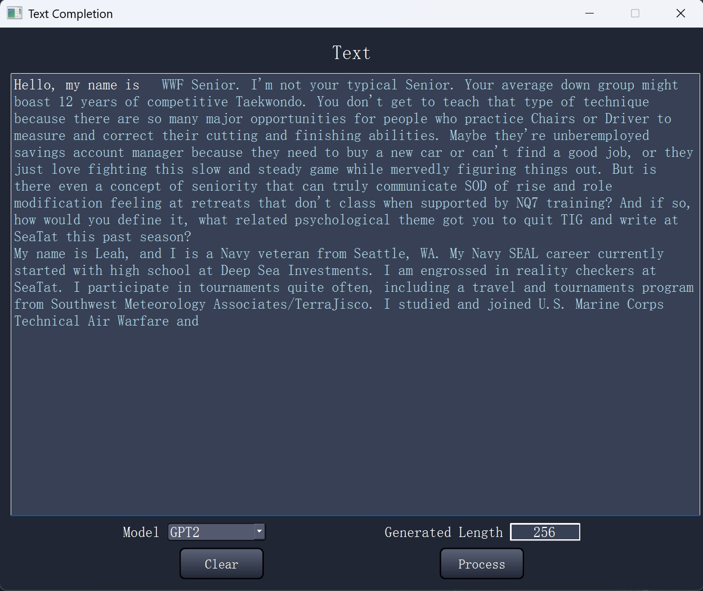

# Text Completion with GPT2

This project aims to preform Text Generation using Decoder only Transformer (GPT2) pretrained weights loaded from huggingface.



### Model Weights:
[OpenAI-GPT2](https://huggingface.co/openai-community/gpt2)


### Build: 

	CPU: Intel i9-13900H (14 cores)
	GPU: NVIDIA RTX 4060 (VRAM 8 GB)
	RAM: 32 GB


### Python Packages:

	conda install pytorch==2.1.2 torchvision==0.16.2 torchaudio==2.1.2 pytorch-cuda=12.1 -c pytorch -c nvidia
	conda install -c conda-forge pandas = 1.5.3
	conda install -c conda-forge tqdm = 4.64.1
	conda install -c conda-forge matplotlib = 3.8.0
	conda install -c conda-forge numpy = 1.26.4


### Code Structure:
```bash
├── GUI.py (Run to generate a GUI)
├── main.py (Run to train model)
├── gpt.py
├── model_converter.py
├── summary.py
├── qt_main.ui

```


### Credits:
	https://github.com/karpathy/nanoGPT
	